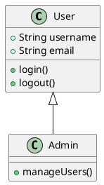

# UML and System Design Repositories

## Table of Contents
- [UML Diagram Tools](#uml-diagram-tools)
- [System Design Resources](#system-design-resources)
- [Game System Design (ECS)](#game-system-design-ecs)
- [Architecture Patterns](#architecture-patterns)
- [Best Practices](#best-practices)

---

## UML Diagram Tools

### Overview
UML (Unified Modeling Language) is a standardized modeling language consisting of an integrated set of diagrams, used to specify, visualize, construct, and document the artifacts of a software system. It provides a standard way to visualize the design of a system.

### Core UML Repositories

#### 1. PlantUML
- **URL**: https://github.com/plantuml/plantuml
- **Website**: https://plantuml.com/
- **Description**: Generate diagrams from textual description
- **Language**: Java
- **Last Updated**: January 28, 2025
- **Key Features**:
  - Text-based diagram generation
  - Multiple diagram types supported
  - Integration with various tools and IDEs
  - Active development and maintenance
  - Can be embedded in markdown, wikis, and documentation

**Supported Diagram Types**:
1. **Sequence Diagram** - Object interactions over time
2. **Use Case Diagram** - System functionality from user perspective
3. **Class Diagram** - Static structure of classes
4. **Object Diagram** - Instance of class diagram at a point in time
5. **Activity Diagram** - Workflow of stepwise activities
6. **Component Diagram** - Organization and dependencies of components
7. **Deployment Diagram** - Hardware topology
8. **State Diagram** - States and state transitions
9. **Timing Diagram** - Timing constraints
10. **Network Diagram** - Network topology
11. **Wireframe** - UI mockups
12. **Archimate** - Enterprise architecture
13. **Gantt Diagram** - Project scheduling
14. **MindMap** - Ideas and concepts
15. **WBS (Work Breakdown Structure)** - Project decomposition
16. **JSON/YAML Visualization** - Data structure visualization

**PlantUML Example**:


**GitHub Integration**:
- Use proxy services to render PlantUML in GitHub markdown
- GitHub Actions available for automated diagram generation
- Can be integrated into CI/CD pipelines

**Related PlantUML Repositories**:
- **PlantUML Grammar**: Formal grammar definition for syntax parsing, validation, and editor integration
- **PlantUML Testing**: Utility to compare different PlantUML versions on comprehensive test sets
- **PlantUML Exporters**: Tools to convert other formats to PlantUML

#### 2. StarUML Export PlantUML
- **URL**: https://github.com/TimeWarpEngineering/staruml-export-plantuml
- **Description**: Plugin to convert StarUML models to PlantUML diagrams
- **Use Case**: Bridge between visual UML tools and text-based PlantUML
- **Features**:
  - Extracts classes and associations from StarUML
  - Generates PlantUML syntax
  - Enables version control of UML diagrams

#### 3. UML Diagram Tools (GitHub Topics)
- **Topic URL**: https://github.com/topics/uml-diagram
- **Tools Available**:
  - Automatic class diagram generators from source code
  - Support for multiple output formats (Graphviz, PlantUML, Mermaid)
  - Language-specific UML generators (Java, Python, C++, etc.)
  - UML to code generators
  - Code to UML reverse engineering tools

### UML vs Mermaid

| Feature | PlantUML | Mermaid |
|---------|----------|---------|
| **Syntax** | More verbose, feature-rich | Simpler, markdown-like |
| **Diagram Types** | 15+ types | 10+ types |
| **GitHub Native** | ❌ No (needs proxy) | ✅ Yes |
| **Installation** | Requires Java | JavaScript-based |
| **Learning Curve** | Steeper | Gentler |
| **Customization** | Extensive | Moderate |
| **Best For** | Complex UML diagrams | Quick documentation |
| **Enterprise Features** | ✅ Extensive | ⚠️ Growing |
| **IDE Integration** | Excellent | Good |

### When to Use PlantUML vs Mermaid

**Use PlantUML for**:
- Traditional UML diagrams (formal software engineering)
- Enterprise architecture diagrams
- Complex component diagrams
- Deployment diagrams
- Archimate diagrams
- When you need maximum customization

**Use Mermaid for**:
- Quick documentation in GitHub
- Modern dev-focused diagrams
- Simple flowcharts and sequence diagrams
- When GitHub native rendering is important
- When simplicity is preferred over features

---

## System Design Resources

### Overview
System design focuses on defining the architecture, components, modules, interfaces, and data for a system to satisfy specified requirements. It's crucial for building scalable, maintainable, and reliable software systems.

### Top System Design Repositories

#### 1. system-design-primer
- **URL**: https://github.com/donnemartin/system-design-primer
- **Stars**: 271,000+ (one of the most starred repos on GitHub)
- **Description**: Learn how to design large-scale systems. Prep for the system design interview.
- **Key Features**:
  - Organized collection of resources for building systems at scale
  - Summaries of system design topics with pros/cons
  - Study timeline suggestions (short, medium, long)
  - **Anki flashcards** for studying
  - Common system design interview questions
  - Sample discussions, code, and diagrams
  - Performance benchmarks
  - Scalability concepts

**Topics Covered**:
- **Scalability**: Horizontal vs vertical scaling, load balancing, caching, database sharding
- **Performance**: Latency vs throughput, CAP theorem
- **Reliability**: Fault tolerance, redundancy, replication
- **Availability**: High availability patterns, failover
- **Databases**: SQL vs NoSQL, ACID, BASE, denormalization
- **Caching**: CDN, cache invalidation, cache patterns
- **Microservices**: Service discovery, API gateway
- **Message Queues**: Asynchronous processing, pub/sub
- **Security**: Authentication, authorization, encryption
- **Monitoring**: Logging, metrics, alerting

**Interview Questions Covered**:
- Design Pastebin.com
- Design Twitter timeline and search
- Design a web crawler
- Design Facebook chat/messenger
- Design a key-value store
- Design a cache system
- Design Amazon's sales ranking
- Design a URL shortener
- Design recommendation system

#### 2. awesome-system-design
- **URL**: https://github.com/madd86/awesome-system-design
- **Description**: Curated list of System Design (distributed systems) resources
- **Focus**: Distributed computing, microservices architecture
- **Content**: Articles, videos, courses, books
- **Reference Note**: Lists system-design-primer as having 109k stars (now much higher)

#### 3. awesome-system-design-resources
- **URL**: https://github.com/ashishps1/awesome-system-design-resources
- **Description**: Learn System Design concepts and prepare for interviews using free resources
- **Format**: Organized by topic with links to articles, videos, courses
- **Target Audience**: Interview preparation and practical learning

#### 4. karanpratapsingh/system-design
- **URL**: https://github.com/karanpratapsingh/system-design
- **Description**: Comprehensive course on designing systems at scale
- **Format**: Structured course material
- **Depth**: In-depth coverage of system design concepts

#### 5. checkcheckzz/system-design-interview
- **URL**: https://github.com/checkcheckzz/system-design-interview
- **Description**: System design interview for IT companies
- **Approach**: Systematic approach to handling system design interviews
- **Timeline**: Designed for short-term preparation

#### 6. codersguild/System-Design
- **URL**: https://github.com/codersguild/System-Design
- **Description**: How is modern software designed?
- **Topics**: Scalability, maintainability, eventual consistency, availability, reliability
- **Focus**: Interview preparation with practical considerations

#### 7. shashank88/system_design
- **URL**: https://github.com/shashank88/system_design
- **Description**: Preparation links and resources for system design questions
- **Format**: Curated links organized by topic

### System Design Patterns and Architecture

#### 8. awesome-design-patterns
- **URL**: https://github.com/DovAmir/awesome-design-patterns
- **Description**: Curated list of software and architecture related design patterns
- **Coverage**:
  - Serverless architecture patterns
  - Distributed systems patterns
  - Microservices patterns
  - Cloud computing patterns
  - Domain-Driven Design (DDD)
  - Event-driven architecture
  - CQRS (Command Query Responsibility Segregation)
  - Saga pattern
  - API Gateway pattern
  - Service mesh

#### 9. Design-Microservices-Architecture-with-Patterns-Principles
- **URL**: https://github.com/mehmetozkaya/Design-Microservices-Architecture-with-Patterns-Principles
- **Description**: Design Microservices Architecture with Patterns, Principles and Best Practices
- **Focus**: Handling millions of requests
- **Key Concepts**:
  - High availability design
  - High scalability patterns
  - Low latency optimization
  - Resilience to network failures
  - Distributed microservices patterns

**Topics Covered**:
- Microservices decomposition patterns
- Database per service pattern
- Event sourcing
- CQRS
- API composition
- Saga pattern for distributed transactions
- Circuit breaker pattern
- Service discovery
- API Gateway pattern
- Strangler pattern for migration

#### 10. system-design-patterns
- **URL**: https://github.com/Sairyss/system-design-patterns
- **Description**: Resources related to distributed systems, system design, microservices, scalability and performance
- **Coverage**:
  - Domain-Driven Design (DDD)
  - Software architecture patterns
  - Backend development best practices
  - Clean architecture
  - Hexagonal architecture
  - SOLID principles
  - Design patterns (GoF)

**Includes Code Examples**:
- Practical implementations
- Real-world scenarios
- Best practices demonstrated in code

---

## Game System Design (ECS)

### Overview
Game system design differs significantly from traditional application design. The Entity-Component-System (ECS) architecture is a popular pattern in game development that prioritizes performance, flexibility, and data-oriented design.

### Core Concepts of ECS

**Entity**: A unique identifier (typically just an ID)
**Component**: Pure data containers (no behavior)
**System**: Logic that operates on entities with specific components

**Benefits**:
- Data-oriented design (cache-friendly)
- Composition over inheritance
- Parallelization and multi-threading friendly
- Flexible entity creation
- Performance optimization
- Easy to add/remove features

### ECS Repositories

#### 1. awesome-entity-component-system
- **URL**: https://github.com/jslee02/awesome-entity-component-system
- **Description**: Curated list of Entity-Component-System (ECS) libraries and resources
- **Coverage**: Multiple programming languages
- **Libraries Listed**:
  - **TypeScript/JavaScript**: becsy, bitECS
  - **C++**: EnTT, Flecs
  - **C#**: DefaultEcs, Entitas
  - **Rust**: bevy_ecs, specs, legion
  - **Go**: engo
  - **Game Engines**: Nazara Engine, shiva, Sparky, Engo

#### 2. Flecs - Fast ECS for C & C++
- **URL**: https://github.com/SanderMertens/flecs
- **Stars**: 6,500+
- **Language**: C/C++
- **Description**: A fast entity component system (ECS) for C & C++
- **Key Features**:
  - High performance
  - Multi-threading support
  - Query language for entities
  - Systems can be organized in phases
  - Reflection and serialization
  - Module system
  - Prefabs and inheritance

**Flecs Hub**:
- Collection of repositories showing practical Flecs usage
- Examples: Input handling, hierarchical transforms, rendering systems
- Real-world game system implementations

#### 3. ecs-faq
- **URL**: https://github.com/SanderMertens/ecs-faq
- **Description**: Frequently asked questions about Entity Component Systems
- **Value**: Educational resource explaining ECS concepts
- **Topics**: Design decisions, implementation details, common patterns

#### 4. EnTT - Modern C++ ECS
- **URL**: https://github.com/skypjack/entt
- **Stars**: 10,000+
- **Description**: Gaming meets modern C++ - a fast and reliable entity component system (ECS) and much more
- **Key Features**:
  - Header-only library
  - Type-safe
  - Modern C++ (C++17/20)
  - Extremely fast
  - Minimal memory footprint
  - Signal/event system
  - Resource cache
  - Meta programming utilities

**Usage**:
```cpp
#include <entt/entt.hpp>

entt::registry registry;

// Create entity
auto entity = registry.create();

// Add components
registry.emplace<Position>(entity, 0.0f, 0.0f);
registry.emplace<Velocity>(entity, 1.0f, 1.0f);

// Query entities
auto view = registry.view<Position, Velocity>();
for(auto entity: view) {
    auto &pos = view.get<Position>(entity);
    auto &vel = view.get<Velocity>(entity);
    pos.x += vel.x;
    pos.y += vel.y;
}
```

#### 5. ecs-game-architecture Examples
- **URL**: https://github.com/smwbalfe/ecs-game-architecture
- **Description**: Project demonstrating use of ECS for data-driven architecture in rendering games
- **Purpose**: Educational example

- **URL**: https://github.com/tylersuehr7/ecs-game-architecture
- **Description**: Lightweight C++ ECS framework for game development
- **Focus**: Simplicity and ease of use
- **Target**: Arcade games, indie projects, educational purposes

#### 6. Kengine
- **URL**: https://github.com/phisko/kengine
- **Description**: Game engine with ECS architecture
- **Focus**:
  - Ease-of-use
  - Runtime extensibility
  - Compile-time type safety
- **Features**: Complete game engine built on ECS principles

### ECS in Popular Game Engines

**Unity DOTS (Data-Oriented Technology Stack)**:
- Unity's modern ECS implementation
- High-performance multithreaded system
- Burst compiler for optimized code
- Job system for parallelization

**Bevy (Rust)**:
- Modern game engine built on ECS
- Entity-Component-System as core architecture
- Powerful query system
- Plugin architecture

**Godot 4.x**:
- Not pure ECS but node-based with component thinking
- Scene tree architecture

### Traditional OOP vs ECS in Games

| Aspect | Traditional OOP | ECS |
|--------|----------------|-----|
| **Inheritance** | Deep hierarchies | Composition |
| **Data Layout** | Scattered in memory | Contiguous arrays |
| **Cache Performance** | Poor (cache misses) | Excellent (cache-friendly) |
| **Multithreading** | Difficult | Natural |
| **Flexibility** | Rigid hierarchies | Dynamic composition |
| **Performance** | Lower | Higher |
| **Complexity** | Simpler for small projects | Better for large projects |
| **Code Reuse** | Through inheritance | Through systems |

---

## Architecture Patterns

### Cloud-Native Patterns
1. **Microservices**: Decompose applications into small, independent services
2. **Service Mesh**: Infrastructure layer for service-to-service communication
3. **Serverless**: Event-driven, function-as-a-service architecture
4. **API Gateway**: Single entry point for clients
5. **Circuit Breaker**: Prevent cascading failures
6. **Bulkhead**: Isolate resources to prevent total failure
7. **Saga**: Manage distributed transactions
8. **Event Sourcing**: Store state changes as events
9. **CQRS**: Separate read and write models

### Traditional Patterns
1. **Layered (N-tier)**: Separation of concerns in layers
2. **MVC (Model-View-Controller)**: Separate data, presentation, and control
3. **Repository Pattern**: Abstraction for data access
4. **Factory Pattern**: Object creation abstraction
5. **Singleton Pattern**: Single instance of a class
6. **Observer Pattern**: Event notification system
7. **Strategy Pattern**: Interchangeable algorithms
8. **Adapter Pattern**: Interface compatibility

### Domain-Driven Design (DDD)
- **Bounded Contexts**: Clear boundaries between domains
- **Aggregates**: Consistency boundaries
- **Entities**: Objects with identity
- **Value Objects**: Immutable objects without identity
- **Domain Events**: Significant occurrences in the domain
- **Repositories**: Persistence abstraction
- **Services**: Domain logic not belonging to entities

---

## Best Practices

### System Design Best Practices

#### 1. Start with Requirements
- Functional requirements (what the system should do)
- Non-functional requirements (performance, scalability, availability)
- Constraints (time, budget, technology)
- Assumptions (user base, growth rate)

#### 2. High-Level Design
- Identify major components
- Define interfaces between components
- Choose appropriate architecture patterns
- Consider data flow

#### 3. Component Design
- Define responsibilities clearly
- Keep components loosely coupled
- Design for scalability
- Plan for failure (fault tolerance)

#### 4. Database Design
- Choose SQL vs NoSQL based on requirements
- Design schema for read/write patterns
- Plan for sharding/partitioning
- Consider replication strategy
- Index optimization

#### 5. Scalability Considerations
- **Vertical Scaling**: Add more resources to single machine
- **Horizontal Scaling**: Add more machines
- **Load Balancing**: Distribute traffic
- **Caching**: Reduce database load
- **CDN**: Serve static content closer to users
- **Asynchronous Processing**: Use message queues

#### 6. Performance Optimization
- Identify bottlenecks (profiling)
- Optimize critical paths
- Use appropriate data structures
- Implement caching strategically
- Minimize network calls
- Database query optimization

#### 7. Reliability and Availability
- **Redundancy**: Multiple instances of critical components
- **Failover**: Automatic switching to backup
- **Health Checks**: Monitor component status
- **Circuit Breakers**: Prevent cascading failures
- **Rate Limiting**: Protect against overload
- **Graceful Degradation**: Maintain partial functionality

#### 8. Security
- Authentication and authorization
- Input validation
- SQL injection prevention
- XSS protection
- CSRF protection
- Encryption (data at rest and in transit)
- Secrets management
- Regular security audits

#### 9. Monitoring and Observability
- **Logging**: Structured logs with correlation IDs
- **Metrics**: Key performance indicators
- **Tracing**: Distributed tracing for requests
- **Alerting**: Proactive notification of issues
- **Dashboards**: Real-time system visibility

#### 10. Documentation
- Architecture diagrams (use UML, Mermaid, PlantUML)
- API documentation
- Data flow diagrams
- Sequence diagrams for critical flows
- Decision records (ADRs - Architecture Decision Records)

### UML Diagram Best Practices

1. **Choose the Right Diagram Type**
   - Use case diagram: System functionality
   - Sequence diagram: Interactions over time
   - Class diagram: Static structure
   - Activity diagram: Workflows
   - State diagram: State machines

2. **Keep Diagrams Simple**
   - One concept per diagram
   - Avoid clutter
   - Use appropriate level of detail

3. **Use Consistent Notation**
   - Follow UML standards
   - Maintain naming conventions
   - Use stereotypes appropriately

4. **Version Control**
   - Store diagram source in version control
   - Use text-based formats (PlantUML, Mermaid)
   - Review diagram changes in PRs

5. **Update Diagrams**
   - Keep diagrams in sync with code
   - Update during design changes
   - Archive obsolete diagrams

### ECS Implementation Best Practices

1. **Component Design**
   - Keep components pure data (no methods)
   - Small, focused components
   - Avoid component dependencies

2. **System Design**
   - Each system has single responsibility
   - Systems operate on component combinations
   - Order systems by dependencies

3. **Performance**
   - Use contiguous memory layout
   - Batch similar operations
   - Leverage SIMD when possible
   - Profile before optimizing

4. **Entity Management**
   - Reuse entity IDs
   - Use entity pools
   - Implement entity hierarchies carefully

5. **Data-Oriented Design**
   - Think in terms of data transformations
   - Structure data for cache efficiency
   - Minimize pointer chasing

---

## Comparison: Application System Design vs Game System Design

### Application System Design Priorities
1. **Business Logic**: Complex workflows, transactions
2. **Data Integrity**: ACID properties, consistency
3. **Scalability**: Horizontal scaling, load balancing
4. **Maintainability**: Clean code, modularity
5. **Security**: Authentication, authorization, encryption
6. **Reliability**: Fault tolerance, availability

**Common Patterns**: MVC, Microservices, Layered Architecture, Domain-Driven Design

**Performance**: Important but often secondary to correctness

**Data Flow**: Request-response, event-driven, CRUD operations

### Game System Design Priorities
1. **Performance**: 60+ FPS, low latency
2. **Real-time Processing**: Every frame matters
3. **Predictable Performance**: No GC pauses, consistent frame times
4. **Memory Efficiency**: Console memory constraints
5. **Parallelization**: Multi-core utilization
6. **State Management**: Complex game state, fast updates

**Common Patterns**: ECS, Game Loop, Object Pool, State Pattern, Command Pattern

**Performance**: Critical requirement, not negotiable

**Data Flow**: Update loop, event systems, physics simulation

### Key Differences

| Aspect | Application Design | Game Design |
|--------|-------------------|-------------|
| **Architecture** | Layered, Microservices, DDD | ECS, Game Loop, Scene Graph |
| **Performance** | Optimize when needed | Always critical |
| **Memory** | Garbage collection OK | Manual/pooled management |
| **Multithreading** | Request-based | Data-parallel, every frame |
| **State** | Persistent (database) | Transient (in-memory) |
| **Updates** | Event-driven | Continuous (60+ Hz) |
| **Latency** | Milliseconds to seconds OK | Microseconds matter |
| **Scalability** | Scale out (more servers) | Scale up (GPU, CPU cores) |
| **Data Layout** | Object-oriented | Data-oriented |
| **Flexibility** | Change anytime | Harder to change runtime |

---

## Resources and Links

### UML Tools
- PlantUML: https://plantuml.com/
- PlantUML GitHub: https://github.com/plantuml/plantuml
- PlantText Online Editor: https://www.planttext.com/

### System Design
- System Design Primer: https://github.com/donnemartin/system-design-primer
- Awesome System Design: https://github.com/madd86/awesome-system-design
- Design Patterns: https://github.com/DovAmir/awesome-design-patterns

### Game System Design
- Awesome ECS: https://github.com/jslee02/awesome-entity-component-system
- Flecs: https://github.com/SanderMertens/flecs
- EnTT: https://github.com/skypjack/entt
- ECS FAQ: https://github.com/SanderMertens/ecs-faq

### Architecture Patterns
- Microservices Patterns: https://microservices.io/patterns/
- Cloud Patterns: https://learn.microsoft.com/en-us/azure/architecture/patterns/
- Game Programming Patterns: https://gameprogrammingpatterns.com/

---

## Conclusion

Understanding both traditional system design and game-specific patterns is valuable for modern software engineers:

- **UML tools** like PlantUML provide formal diagramming for complex systems
- **System design** resources help build scalable, reliable applications
- **ECS architecture** showcases data-oriented design for high-performance systems
- **Architecture patterns** provide proven solutions to common problems

Whether building web applications, distributed systems, or games, choosing the right architecture and tools for your specific requirements is crucial for success.
