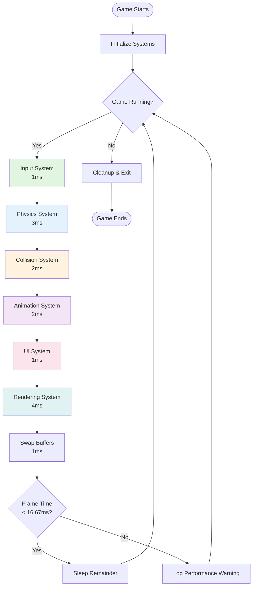
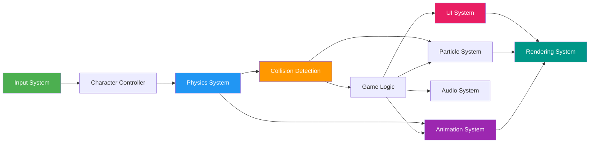
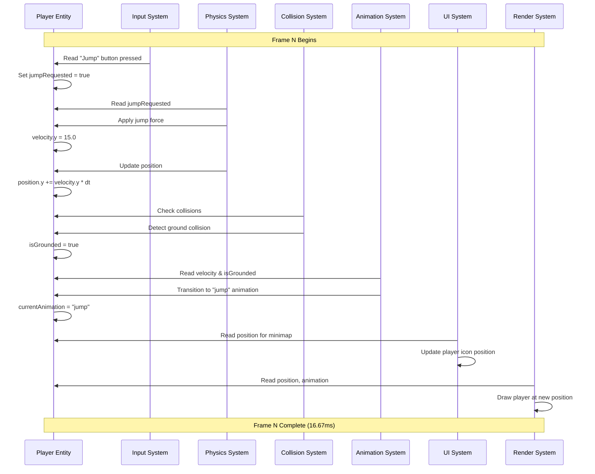
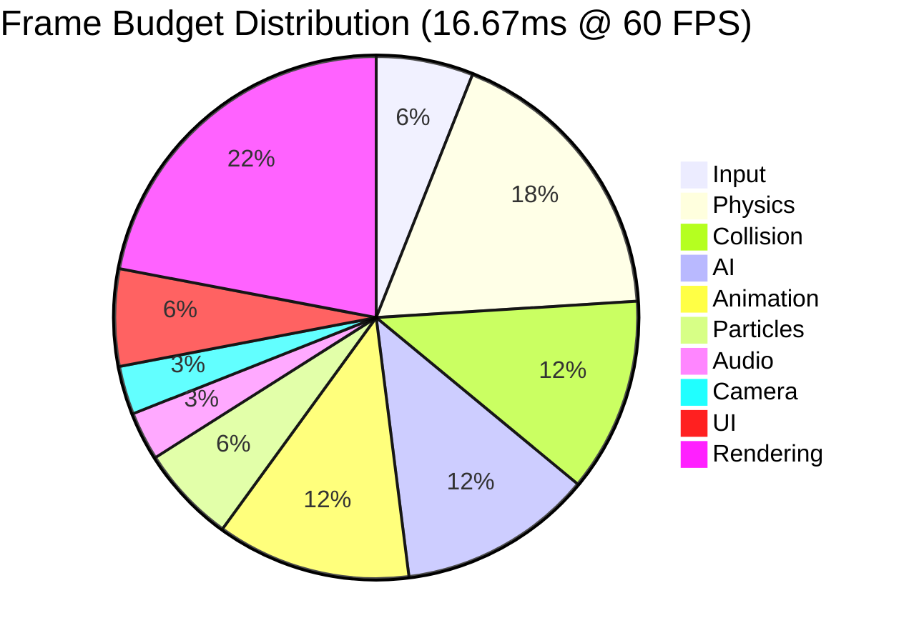
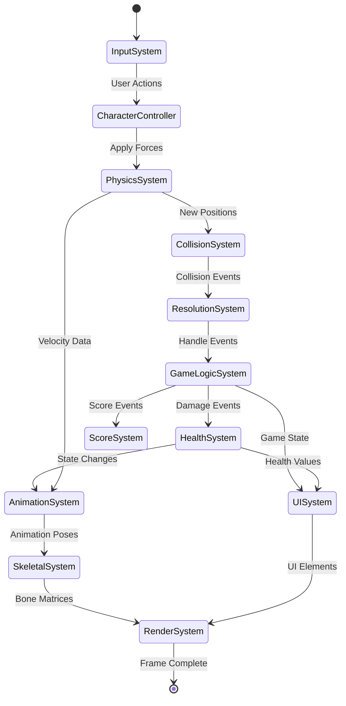
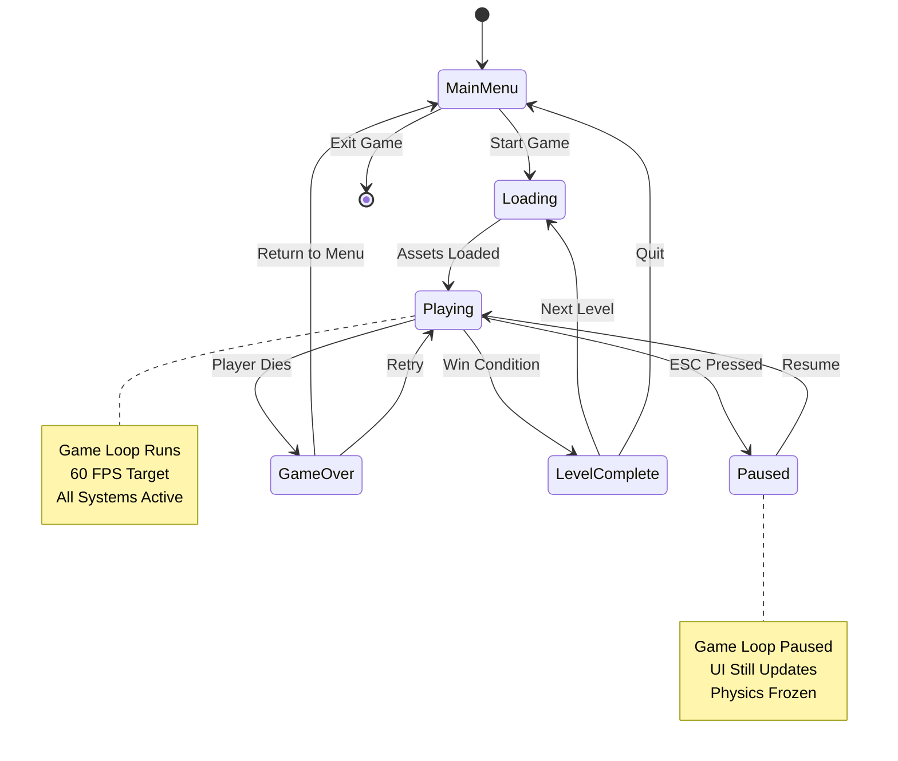
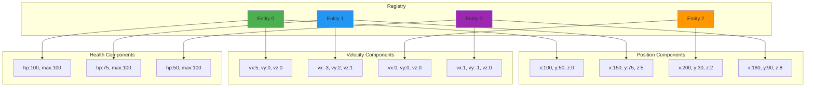

# Understanding Abstractions and the Game Loop

## Table of Contents
- [Part 1: What is an Abstraction?](#part-1-what-is-an-abstraction)
  - [The Fundamental Concept](#the-fundamental-concept)
  - [Characteristics of Good Abstractions](#characteristics-of-good-abstractions)
  - [Layers of Abstraction](#layers-of-abstraction)
  - [Abstraction in Different Contexts](#abstraction-in-different-contexts)
- [Part 2: The Game Loop - How Everything Fits](#part-2-the-game-loop---how-everything-fits)
  - [The Single Loop Illusion](#the-single-loop-illusion)
  - [System Orchestration](#system-orchestration)
  - [Time Slicing](#time-slicing)
  - [Visual Breakdown](#visual-breakdown)
  - [Real Example Walkthrough](#real-example-walkthrough)

---

# Part 1: What is an Abstraction?

## The Fundamental Concept

**Abstraction** is hiding complexity behind a simpler interface.

Think of it like this:

```
COMPLEX REALITY          ABSTRACTION         SIMPLE INTERFACE
================         ===========         ================
Thousands of           →   "Drive"      →    Turn steering wheel
mechanical parts           concept            Press pedal
Fuel injection
Engine timing
Transmission gears
```

You don't need to know **how** the engine works to **use** the car.

### Core Characteristics

An abstraction has these essential properties:

#### 1. **Hides Implementation Details**

```cpp
// WITHOUT abstraction - you see all the complexity
int main() {
    // Manually allocate memory
    int* buffer = (int*)malloc(1024 * sizeof(int));

    // Manually track size
    int size = 0;

    // Manually add elements
    buffer[size++] = 42;
    buffer[size++] = 17;

    // Manually free memory
    free(buffer);
}

// WITH abstraction - complexity hidden
int main() {
    std::vector<int> numbers;  // Abstraction!

    numbers.push_back(42);     // Just use it
    numbers.push_back(17);

    // Memory freed automatically
}
```

**What's hidden**:
- Memory allocation strategy
- Resizing when full
- Copying elements
- Memory deallocation

**What you see**:
- `push_back()` - add element
- `size()` - how many elements
- `[]` - access element

#### 2. **Provides a Mental Model**

Good abstractions give you a way to **think** about something without understanding the details.

```
Abstraction: "File"
Mental Model: A document that stores data

Reality behind it:
- Disk sectors and blocks
- File system metadata (inode)
- Buffer cache in RAM
- Disk controller commands
- Magnetic platters spinning
- Read/write heads moving
```

You think: "Save this file"
Computer does: 50+ operations across hardware and software layers

#### 3. **Raises the Level of Thinking**

Abstractions let you work at a higher conceptual level:

```
LEVEL 5: Business Logic
"Process customer order"
    ↓ (abstracts away)

LEVEL 4: Application Functions
"validateOrder(), chargePayment(), updateInventory()"
    ↓ (abstracts away)

LEVEL 3: Data Structures
"array.find(), map.insert(), queue.push()"
    ↓ (abstracts away)

LEVEL 2: Memory Operations
"malloc(), memcpy(), free()"
    ↓ (abstracts away)

LEVEL 1: CPU Instructions
"MOV, ADD, JMP, CMP"
    ↓ (abstracts away)

LEVEL 0: Transistors
Billions of switches turning on/off
```

At Level 5, you don't think about transistors. The abstraction layers raise your thinking.

#### 4. **Defines a Contract/Interface**

Abstractions promise: "If you interact with me THIS way, I'll do THAT thing."

```cpp
// Contract: "I store things and give them back"
class Stack {
public:
    void push(int value);   // Contract: Add to top
    int pop();              // Contract: Remove from top and return it
    int peek();             // Contract: Look at top without removing
    bool isEmpty();         // Contract: Tell if empty
};

// How it's implemented doesn't matter!
// Could be an array, linked list, or magic fairy dust
// As long as it follows the contract
```

#### 5. **Enables Substitution**

Because abstractions define contracts, you can swap implementations:

```cpp
// Abstraction: "Something you can draw"
class Drawable {
public:
    virtual void draw() = 0;  // Contract
};

// Different implementations
class Circle : public Drawable {
    void draw() override { /* draw circle */ }
};

class Square : public Drawable {
    void draw() override { /* draw square */ }
};

// Use any drawable the same way
void render(Drawable* shape) {
    shape->draw();  // Don't care which shape!
}
```

This is **polymorphism** - enabled by abstraction.

---

## Characteristics of Good Abstractions

Not all abstractions are created equal. Good ones share these traits:

### 1. **Leaky vs. Non-Leaky**

**Leaky Abstraction**: Implementation details leak through

```cpp
// LEAKY: You have to know it's an array underneath
std::vector<int> numbers;
numbers.reserve(1000);  // Wait, why do I need to know about capacity?

// The abstraction "leaked" - you need to understand memory allocation
// to use it efficiently
```

**Non-Leaky**: Implementation completely hidden

```python
# NON-LEAKY: Just add numbers, don't care how
numbers = []
numbers.append(42)
numbers.append(17)
# Python handles all memory details
```

**Reality**: All abstractions leak eventually. The question is **how much** and **when**.

### 2. **Right Level of Detail**

Too low-level:
```cpp
// Too detailed - not really abstracting much
void setPixel(int x, int y, int red, int green, int blue);
drawLine(0, 0, 100, 100, 255, 0, 0);  // Every pixel manually
```

Too high-level:
```cpp
// Too abstract - lost control
void drawEverything();  // What does this even draw?
```

Just right:
```cpp
// Good abstraction level
void drawLine(Point start, Point end, Color color);
void drawCircle(Point center, float radius, Color color);
```

### 3. **Cohesion (Does One Thing Well)**

```cpp
// BAD: Does too many unrelated things
class GameObject {
    void update();        // Game logic
    void render();        // Graphics
    void playSound();     // Audio
    void sendNetwork();   // Networking
    void saveToDatabase(); // Persistence
};

// GOOD: Each abstraction does one thing
class Transform { /* position, rotation, scale */ };
class Renderer { /* drawing */ };
class AudioSource { /* sound */ };
class NetworkSync { /* networking */ };
```

### 4. **Loose Coupling (Independent)**

```cpp
// BAD: Tightly coupled - Physics knows about Rendering
class PhysicsEngine {
    Renderer* renderer;  // Why does physics need renderer?

    void update() {
        calculateForces();
        renderer->drawDebugLines();  // Coupled!
    }
};

// GOOD: Loosely coupled - Physics independent
class PhysicsEngine {
    void update() {
        calculateForces();
        // Just do physics, don't know about rendering
    }

    std::vector<DebugLine> getDebugLines() {
        // Renderer can ask for this if it wants
    }
};
```

### 5. **Composability (Works with Other Abstractions)**

```cpp
// Good abstractions compose nicely
std::vector<int> numbers = {1, 2, 3, 4, 5};

// Compose: vector + algorithm + lambda
auto result = std::count_if(
    numbers.begin(),           // Abstraction: Iterator
    numbers.end(),
    [](int n) { return n > 2; } // Abstraction: Lambda
);
// Each abstraction works with others seamlessly
```

---

## Layers of Abstraction

Abstractions stack on top of each other. Each layer uses the one below:

### Software Stack Example

```
┌─────────────────────────────────────────┐
│  LEVEL 7: User Application              │
│  "Click to save document"               │
└─────────────────────────────────────────┘
              ↓ uses
┌─────────────────────────────────────────┐
│  LEVEL 6: Application Framework         │
│  saveDocument() function                │
└─────────────────────────────────────────┘
              ↓ uses
┌─────────────────────────────────────────┐
│  LEVEL 5: File System API               │
│  fopen(), fwrite(), fclose()            │
└─────────────────────────────────────────┘
              ↓ uses
┌─────────────────────────────────────────┐
│  LEVEL 4: Operating System              │
│  System calls (write, open, close)     │
└─────────────────────────────────────────┘
              ↓ uses
┌─────────────────────────────────────────┐
│  LEVEL 3: Device Drivers                │
│  Disk driver commands                   │
└─────────────────────────────────────────┘
              ↓ uses
┌─────────────────────────────────────────┐
│  LEVEL 2: Hardware Interface            │
│  SATA/NVMe controller                   │
└─────────────────────────────────────────┘
              ↓ uses
┌─────────────────────────────────────────┐
│  LEVEL 1: Physical Hardware             │
│  SSD chips, magnetic platters           │
└─────────────────────────────────────────┘
              ↓ uses
┌─────────────────────────────────────────┐
│  LEVEL 0: Physics                       │
│  Electrons, magnetism, quantum effects  │
└─────────────────────────────────────────┘
```

**Key Insight**: You interact with Level 7. All the complexity below is abstracted away.

### Game Engine Stack

```
┌─────────────────────────────────────────┐
│  Your Game                              │
│  "Player shoots enemy"                  │
└─────────────────────────────────────────┘
              ↓
┌─────────────────────────────────────────┐
│  Gameplay Systems                       │
│  WeaponSystem, HealthSystem, ScoreSystem│
└─────────────────────────────────────────┘
              ↓
┌─────────────────────────────────────────┐
│  Entity Component System (ECS)          │
│  Registry, Components, Systems          │
└─────────────────────────────────────────┘
              ↓
┌─────────────────────────────────────────┐
│  Core Engine Systems                    │
│  Physics, Rendering, Audio, Input       │
└─────────────────────────────────────────┘
              ↓
┌─────────────────────────────────────────┐
│  Platform Layer                         │
│  Window, Graphics API, File I/O         │
└─────────────────────────────────────────┘
              ↓
┌─────────────────────────────────────────┐
│  Operating System                       │
│  Windows, Linux, macOS, Console OS      │
└─────────────────────────────────────────┘
              ↓
┌─────────────────────────────────────────┐
│  Hardware                               │
│  CPU, GPU, RAM, Storage                 │
└─────────────────────────────────────────┘
```

Each layer is an abstraction that hides the complexity below it.

---

## Abstraction in Different Contexts

### Mathematics

**Abstraction**: A number
**Reality**: Represents quantity, but has no physical form

```
"3" is an abstraction
3 apples - concrete
3 cars - concrete
3 ideas - abstract

The number "3" itself? Pure abstraction.
```

### Language

**Abstraction**: The word "chair"
**Reality**: Millions of different physical objects

```
"Chair" abstracts over:
- Wooden chairs
- Metal chairs
- Office chairs
- Bean bag chairs
- Throne

All different, but share "chairness" - the abstraction
```

### Programming

**Abstraction**: Loop
**Reality**: Jump instructions and condition checks

```cpp
// High-level abstraction
for (int i = 0; i < 10; i++) {
    print(i);
}

// What CPU actually does (assembly):
    MOV  ECX, 0          ; i = 0
loop_start:
    CMP  ECX, 10         ; i < 10?
    JGE  loop_end        ; if not, exit
    PUSH ECX             ; save i
    CALL print           ; call print(i)
    POP  ECX             ; restore i
    INC  ECX             ; i++
    JMP  loop_start      ; repeat
loop_end:
```

The `for` loop is an abstraction over the assembly pattern.

---

## Why Abstractions Matter

### 1. **Manage Complexity**

Modern software has millions of lines of code. Without abstraction, it would be impossible to understand.

```
Windows 10: ~50 million lines of code
Google Chrome: ~25 million lines

No human can understand all of it.
But you CAN understand the abstractions:
- "Window" - a rectangle that displays content
- "File" - stores data
- "Tab" - separate browsing context
```

### 2. **Enable Collaboration**

Different people work on different layers:

```
Game Team Structure:

Gameplay Programmers → Use Engine APIs
Engine Programmers   → Build Engine Systems
Graphics Programmers → Optimize Rendering
Platform Programmers → Handle OS/Hardware

Each team works with different abstractions.
The engine API is the abstraction that lets them collaborate.
```

### 3. **Allow Progress**

You can improve implementation without changing the interface:

```cpp
// Version 1: Simple implementation
class ArrayList {
    int* data;
    int size;

public:
    void add(int value) {
        data[size++] = value;  // Simple
    }
};

// Version 2: Better implementation
class ArrayList {
    int* data;
    int size;
    int capacity;

public:
    void add(int value) {
        if (size >= capacity) {
            resize();  // Smarter!
        }
        data[size++] = value;
    }
};

// Users don't need to change their code!
// list.add(42) still works the same way
```

### 4. **Enable Reuse**

Good abstractions work in many contexts:

```cpp
// Generic abstraction: Container
template<typename T>
class Container {
    virtual void add(T item) = 0;
    virtual T get(int index) = 0;
    virtual int size() = 0;
};

// Reuse for different types
Container<int> numbers;
Container<string> names;
Container<GameObject> entities;
Container<Texture> textures;
```

---

# Part 2: The Game Loop - How Everything Fits

## The Single Loop Illusion

Here's the key insight: **There IS only one loop**, but it runs multiple systems in sequence.

Think of it like a factory assembly line:

```
Assembly Line (one loop, multiple stations):

Raw Material → Station 1 → Station 2 → Station 3 → Finished Product
                (Input)     (Physics)   (Graphics)   (Display)

The assembly line makes one pass.
Each station does its job.
Repeat 60 times per second.
```

### The Basic Structure

```cpp
while (gameRunning) {
    // This is ONE iteration of ONE loop
    // But inside, we call multiple systems

    handleInput();      // System 1
    updatePhysics();    // System 2
    updateAI();         // System 3
    updateAnimation();  // System 4
    render();           // System 5

    // End of loop - start next frame
}
```

**Crucially**: Each system runs **once per frame**, in order.

---

## System Orchestration

Let's see how ALL the systems fit in ONE loop iteration:

### Detailed Single Frame

```cpp
void runOneFrame() {
    // FRAME N begins

    // ═══════════════════════════════════════════════════════
    // PHASE 1: INPUT (2-5ms)
    // ═══════════════════════════════════════════════════════
    pollOSEvents();           // Get keyboard, mouse, controller
    updateInputState();       // Process into game actions
    processUIInput();         // UI gets first chance at input

    // ═══════════════════════════════════════════════════════
    // PHASE 2: FIXED UPDATE - Deterministic (3-8ms)
    // ═══════════════════════════════════════════════════════
    // This might run 0, 1, or multiple times per frame!

    float accumulator = 0.0f;
    accumulator += deltaTime;

    while (accumulator >= FIXED_TIMESTEP) {
        // Character controllers
        updatePlayerController();
        updateEnemyControllers();

        // Physics simulation
        applyForces();
        integrateVelocities();  // position += velocity * dt

        // Collision detection
        broadPhaseCollision();  // Spatial partitioning
        narrowPhaseCollision(); // Actual checks
        resolveCollisions();    // Separate & bounce

        // Game logic
        updateGameRules();
        checkWinConditions();

        accumulator -= FIXED_TIMESTEP;
    }

    // ═══════════════════════════════════════════════════════
    // PHASE 3: VARIABLE UPDATE - Visual smoothness (5-10ms)
    // ═══════════════════════════════════════════════════════

    // AI (doesn't need fixed timestep)
    updateAIStateMachines();
    updatePathfinding();

    // Animation
    updateAnimationStateMachines();  // Transitions
    sampleAnimationClips();          // Keyframes
    blendAnimations();               // Smooth blending
    updateSkeletons();               // Bone transforms

    // Particles
    updateParticleEmitters();
    simulateParticles();

    // Audio
    update3DAudioPositions();
    processAudioEffects();

    // Camera
    updateCameraFollow();
    applyCameraShake();

    // ═══════════════════════════════════════════════════════
    // PHASE 4: UI UPDATE (1-3ms)
    // ═══════════════════════════════════════════════════════
    updateHealthBars();    // Read game state
    updateInventoryUI();
    updateMinimap();
    animateUIElements();

    // ═══════════════════════════════════════════════════════
    // PHASE 5: RENDERING (5-12ms)
    // ═══════════════════════════════════════════════════════

    // Prepare
    frustumCulling();         // Remove off-screen objects
    sortTransparentObjects(); // Back to front
    updateGPUBuffers();       // Upload bone matrices, etc.

    // Render 3D
    clearScreen();
    renderSkybox();
    renderOpaque();           // Solid objects
    renderTransparent();      // Windows, water, etc.
    renderParticles();
    renderDebugShapes();      // Collision boxes if enabled

    // Post-processing
    applyBloom();
    applyColorGrading();

    // Render UI (2D, on top)
    renderUIBackground();
    renderUIElements();
    renderTooltips();
    renderDebugText();        // FPS counter

    // ═══════════════════════════════════════════════════════
    // PHASE 6: FINALIZE (1ms)
    // ═══════════════════════════════════════════════════════
    swapBuffers();            // Show frame to user
    limitFrameRate();         // Sleep if needed

    // FRAME N ends - took 16.67ms (60 FPS)
    // Start FRAME N+1
}
```

**Total**: All of this happens in ONE iteration of the game loop!

---

## Time Slicing

The key to understanding how everything fits is **time slicing** - each system gets a slice of the 16.67ms frame budget.

### Frame Budget Breakdown (60 FPS = 16.67ms)

```
TOTAL: 16.67ms per frame
├─ Input:       1ms    ( 6%)
├─ Physics:     3ms    (18%)
├─ Collision:   2ms    (12%)
├─ AI:          2ms    (12%)
├─ Animation:   2ms    (12%)
├─ Particles:   1ms    ( 6%)
├─ Audio:       0.5ms  ( 3%)
├─ Camera:      0.5ms  ( 3%)
├─ UI:          1ms    ( 6%)
└─ Rendering:   3.67ms (22%)

If any system takes too long, frame rate drops!
```

### Budget Enforcement

```cpp
void runFrame() {
    Timer frameTimer;
    frameTimer.start();

    // Run all systems
    runAllSystems();

    float frameTime = frameTimer.elapsed();

    if (frameTime > 16.67f) {
        // Frame took too long!
        // Options:
        // 1. Drop quality (lower LOD)
        // 2. Skip non-critical updates
        // 3. Warn developers
        logWarning("Frame overbudget: " + frameTime + "ms");
    }
}
```

### Profiling View

What developers see:

```
FRAME 1234 - 16.2ms (61 FPS)
╔═══════════════════════════════════════╗
║ Input           ▓░░░                  ║  1.1ms
║ Physics         ▓▓▓░░░░               ║  3.2ms
║ Collision       ▓▓░░░                 ║  2.1ms
║ AI              ▓▓░░░                 ║  2.0ms
║ Animation       ▓▓░░░                 ║  1.9ms
║ Particles       ▓░░                   ║  0.8ms
║ Audio           ░░                    ║  0.4ms
║ Camera          ░░                    ║  0.5ms
║ UI              ▓░░░                  ║  1.2ms
║ Rendering       ▓▓▓░░░░               ║  3.0ms
╚═══════════════════════════════════════╝
Total: 16.2ms (budget: 16.67ms) ✓ OK
```

If rendering takes 10ms instead of 3ms:

```
FRAME 1235 - 23.4ms (42 FPS) ⚠ OVERBUDGET
╔═══════════════════════════════════════╗
║ Input           ▓░░░                  ║  1.0ms
║ Physics         ▓▓▓░░░░               ║  3.1ms
║ ...                                   ║
║ Rendering       ▓▓▓▓▓▓▓▓▓▓░░░░░░      ║ 10.2ms ⚠
╚═══════════════════════════════════════╝
Total: 23.4ms (budget: 16.67ms) ✗ DROPPED FRAME
```

---

## Visual Breakdown

### How Systems Flow Through Time

Imagine each system as a station on an assembly line:

```
TIME: 0ms                                           16.67ms
      ├─────────────────────────────────────────────────┤

Input:      [███]
             0  1ms

Physics:        [████████]
                1  4ms

Collision:             [█████]
                       4  6.5ms

Animation:                  [█████]
                            6.5  9ms

UI:                              [██]
                                 9  10ms

Rendering:                          [████████]
                                    10  14ms

Finalize:                                   [██]
                                            14  16ms

Next Frame: ├────────────────────────────────
           16.67ms
```

**Key Points**:
1. Systems run **sequentially**, not simultaneously
2. Each system does its work and exits
3. Next frame starts immediately after

### Parallel Systems (Advanced)

Some engines run systems in parallel on multiple CPU cores:

```
CORE 0: [Input][Physics──────][Rendering────────]
CORE 1:        [AI────][Animation────]
CORE 2:        [Particles][Audio]
CORE 3:        [──────────UI─────────]

Time:   0ms   2ms  4ms   6ms   8ms  10ms  12ms  14ms  16ms
```

But conceptually, it's still one frame executing all systems.

---

## Real Example Walkthrough

Let's trace ONE FRAME of a simple game:

### Game State at Start of Frame

```
Player: position (100, 50), velocity (5, 0), health 100
Enemy:  position (150, 50), velocity (-3, 0), health 50
Bullet: position (110, 50), velocity (10, 0), damage 25
```

### Frame Execution

```cpp
// ════════════════════════════════════════════════════════
// FRAME N START
// ════════════════════════════════════════════════════════

// PHASE 1: INPUT (1ms)
void handleInput() {
    // User presses SPACE
    if (Input::isKeyPressed(SPACE)) {
        playerWantsToJump = true;
    }
}

// PHASE 2: PHYSICS (3ms)
void updatePhysics(float dt) {
    // Move everything
    player.position.x += player.velocity.x * dt;  // 100 + 5*0.016 = 100.08
    enemy.position.x += enemy.velocity.x * dt;    // 150 + (-3)*0.016 = 149.95
    bullet.position.x += bullet.velocity.x * dt;  // 110 + 10*0.016 = 110.16

    // Apply jump if requested
    if (playerWantsToJump) {
        player.velocity.y = 15.0f;  // Jump force
        playerWantsToJump = false;
    }
}

// PHASE 3: COLLISION (2ms)
void checkCollisions() {
    // Check bullet vs enemy
    float distance = distance(bullet.position, enemy.position);
    if (distance < (bullet.radius + enemy.radius)) {
        // COLLISION!
        enemy.health -= bullet.damage;  // 50 - 25 = 25
        bullet.destroy();

        // Trigger hit animation
        enemy.animator.trigger("hurt");

        // Spawn particle effect
        spawnParticles(bullet.position, EXPLOSION_EFFECT);
    }
}

// PHASE 4: ANIMATION (2ms)
void updateAnimations(float dt) {
    // Enemy animator detected "hurt" trigger
    enemy.animator.transitionTo("hurt_animation");

    // Sample current frame of animation
    Pose hurtPose = enemy.animator.getCurrentPose(dt);

    // Apply to skeleton
    enemy.skeleton.setPose(hurtPose);
}

// PHASE 5: UI (1ms)
void updateUI(float dt) {
    // Enemy health changed (50 → 25)
    enemyHealthBar.targetValue = enemy.health / enemy.maxHealth;  // 0.5

    // Animate health bar
    enemyHealthBar.currentValue = lerp(
        enemyHealthBar.currentValue,  // 1.0
        enemyHealthBar.targetValue,    // 0.5
        dt * 5.0f                      // Animation speed
    );
    // currentValue: 1.0 → 0.96 (started animating down)
}

// PHASE 6: RENDERING (4ms)
void render() {
    clearScreen();

    // Render player at (100.08, 50) with idle animation
    drawCharacter(player);

    // Render enemy at (149.95, 50) with hurt animation
    drawCharacter(enemy);

    // Render bullet at (110.16, 50)
    drawSprite(bullet);

    // Render explosion particles at collision point
    drawParticles(explosionEffect);

    // Render health bar (showing 96% full, animating to 50%)
    drawHealthBar(enemyHealthBar);

    // Render FPS counter
    drawText("FPS: 60", {10, 10});
}

swapBuffers();

// ════════════════════════════════════════════════════════
// FRAME N END (took 16.5ms - under budget!)
// ════════════════════════════════════════════════════════

// ════════════════════════════════════════════════════════
// FRAME N+1 START
// ════════════════════════════════════════════════════════

// Everything repeats...
// Player continues moving, enemy health bar continues animating,
// hurt animation continues playing, particles fade out...
```

### Frame-by-Frame State

```
Frame N:
├─ Player moves to (100.08, 50)
├─ Bullet hits enemy at (110.16, 50)
├─ Enemy health: 50 → 25
├─ Hurt animation triggered
├─ Particles spawned
└─ Health bar starts animating: 100% → 96%

Frame N+1:
├─ Player at (100.16, 50)
├─ Bullet destroyed (no longer drawn)
├─ Enemy at (149.90, 50), playing hurt animation (frame 2)
├─ Particles expanding
└─ Health bar: 96% → 89%

Frame N+2:
├─ Player at (100.24, 50)
├─ Enemy at (149.85, 50), hurt animation (frame 3)
├─ Particles fading
└─ Health bar: 89% → 78%

...

Frame N+18:
├─ Player at (101.44, 50)
├─ Enemy at (149.31, 50), hurt animation complete → back to idle
├─ Particles gone
└─ Health bar: 50% (reached target)
```

**See how it works?** Each frame, ALL systems run once. The game state evolves frame by frame.

---

## Common Confusion: "Aren't systems running simultaneously?"

**Short answer**: No (usually).

**Longer answer**: Even when using multiple CPU cores, the **conceptual model** is sequential:

```cpp
// Logical execution (what you think about)
runInput();
runPhysics();
runCollision();
runAnimation();
runRendering();

// Actual execution (what CPU might do)
Thread 1: runInput() → runPhysics() ────────────┐
Thread 2:                runCollision() ────────┼→ Sync Point
Thread 3:                     runAnimation() ───┘
Thread 4: runRendering() (waits for sync)
```

Even with threading:
1. Systems have dependencies (collision needs physics to finish)
2. Must synchronize at frame boundaries
3. Conceptually, still "one frame at a time"

---

## The Game Loop is an Abstraction!

**Abstraction**: "Game Loop" - runs game at 60 FPS
**Reality**: Hundreds of systems coordinating every 16ms

```cpp
// What you write in your game
void onPlayerHit(Enemy enemy) {
    enemy.health -= 10;
}

// What actually happens (behind abstraction)
void onPlayerHit(Enemy enemy) {
    // 1. Collision system detected hit
    // 2. Called your callback
    enemy.health -= 10;
    // 3. Health system will update
    // 4. UI system will notice next frame
    // 5. Health bar will animate over 18 frames
    // 6. Animation system might trigger hit reaction
    // 7. Particle system spawns blood effect
    // 8. Audio system plays hurt sound
    // 9. AI system might trigger flee behavior
    // All orchestrated by the game loop!
}
```

**The abstraction hides**: System orchestration, timing, frame boundaries, update order

**What you see**: "Player hit enemy, enemy took damage"

---

## Summary

### Part 1: Abstractions

**An abstraction**:
1. Hides complexity
2. Provides mental model
3. Raises level of thinking
4. Defines a contract
5. Enables substitution

**Good abstractions**:
- Don't leak implementation details
- Are at the right level
- Do one thing well (cohesion)
- Work independently (loose coupling)
- Compose with other abstractions

### Part 2: The Game Loop

**How everything fits**:
1. **ONE loop** runs 60 times per second
2. **Each iteration** calls multiple systems sequentially
3. **Each system** gets a time slice (budget)
4. **Frame budget**: 16.67ms for 60 FPS
5. **Systems execute** in dependency order

**The execution**:
```
while (running) {
    Input     →  Read user actions
    Physics   →  Simulate world
    Collision →  Detect overlaps
    Animation →  Update poses
    UI        →  Reflect game state
    Rendering →  Draw everything
}
// Repeat 60 times per second
```

**Key insight**: It's not multiple loops running simultaneously. It's ONE loop calling multiple systems in sequence. The loop is the conductor, systems are the musicians.

---

## Visual Summary

```
┌──────────────────────────────────────────────┐
│  ABSTRACTION: Game Loop                      │
│  "Run game at 60 FPS"                        │
└──────────────────────────────────────────────┘
                    │
                    ↓
┌──────────────────────────────────────────────┐
│  REALITY: System Orchestra                   │
│                                              │
│  Frame N (16.67ms):                          │
│  ┌──────┐ ┌─────┐ ┌────┐ ┌─────┐ ┌──────┐  │
│  │Input │→│Phys │→│Coll│→│Anim │→│Render│  │
│  └──────┘ └─────┘ └────┘ └─────┘ └──────┘  │
│   1ms      3ms     2ms     2ms      4ms      │
│                                              │
│  All systems complete → Frame displayed      │
│  Repeat for Frame N+1...                     │
└──────────────────────────────────────────────┘
```

The game loop IS an abstraction that hides the complexity of orchestrating dozens of systems 60 times per second.

---

## Mermaid Diagrams: Game Loop Visualization

### Complete Game Loop Architecture



### Single Frame Execution Timeline

```mermaid
gantt
    title Game Loop - Single Frame (16.67ms @ 60 FPS)
    dateFormat X
    axisFormat %Lms

    section Input
    Poll Events          :0, 1

    section Physics
    Update Physics       :1, 3

    section Collision
    Broad Phase          :4, 1
    Narrow Phase         :5, 1

    section Animation
    State Machines       :6, 1
    Skeletal Update      :7, 1

    section UI
    Update Elements      :8, 1

    section Render
    Culling              :9, 1
    Draw Calls           :10, 2
    Post Process         :12, 1

    section Finalize
    Swap Buffers         :13, 1
```



### System Dependencies Graph



### Entity Data Flow Through Systems



### Frame Budget Pie Chart



### ECS System Update Order



### Parallel Execution on Multi-Core CPU

```mermaid
gantt
    title Multi-Threaded Game Loop (4 CPU Cores)
    dateFormat X
    axisFormat %Lms

    section Core 0
    Input                :c0_1, 0, 1
    Physics              :c0_2, 1, 3
    Rendering            :c0_3, 10, 4

    section Core 1
    Idle                 :c1_1, 0, 4
    Animation            :c1_2, 4, 2
    UI                   :c1_3, 8, 2

    section Core 2
    Idle                 :c2_1, 0, 4
    Collision            :c2_2, 4, 2
    Particles            :c2_3, 6, 2

    section Core 3
    Idle                 :c3_1, 0, 4
    AI                   :c3_2, 4, 3
    Audio                :c3_3, 7, 1
```



### Game State Machine



### Memory Layout: Structure of Arrays (SoA) for ECS



### How to Use These Diagrams

These Mermaid diagrams can be:
1. **Rendered in GitHub** - Automatically displayed in GitHub markdown
2. **Rendered in VSCode** - Using Mermaid preview extensions
3. **Exported to Images** - Using Mermaid CLI or online editor
4. **Used in Documentation** - Most modern documentation tools support Mermaid

To render locally:
```bash
# Install Mermaid CLI
npm install -g @mermaid-js/mermaid-cli

# Convert to PNG
mmdc -i understanding-abstractions-and-game-loop.md -o diagrams/
```

---

*"The art of programming is the art of organizing complexity." - Edsger Dijkstra*
